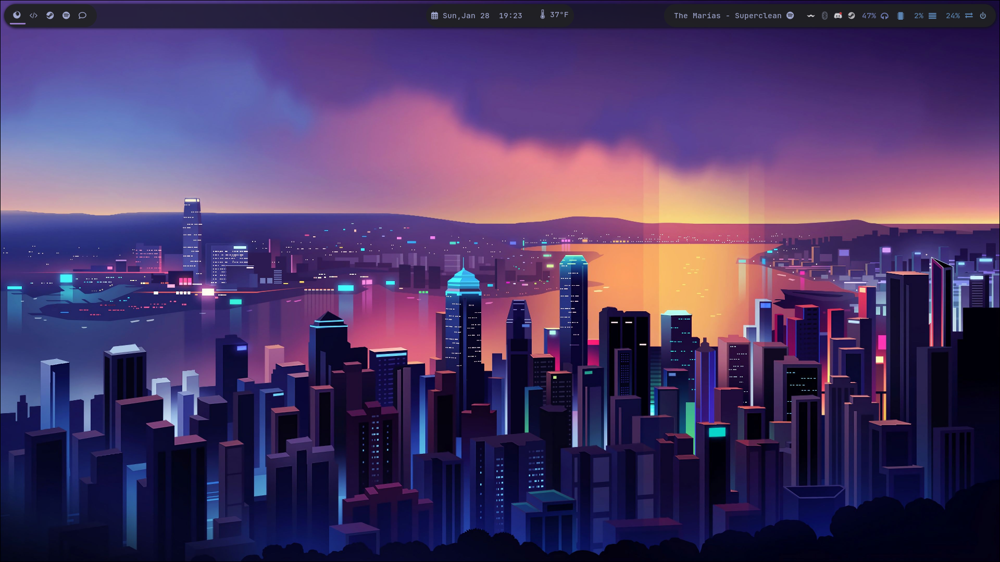
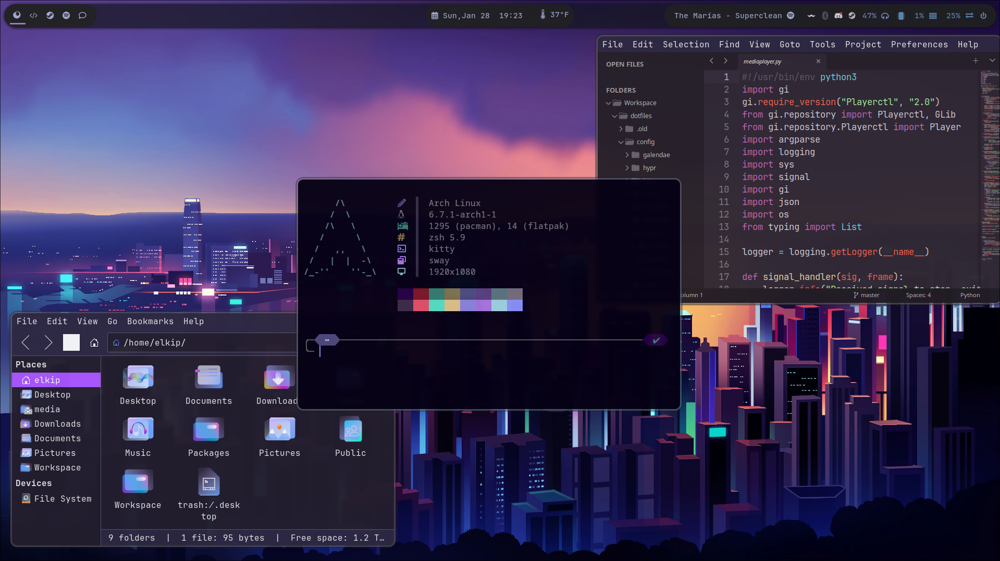
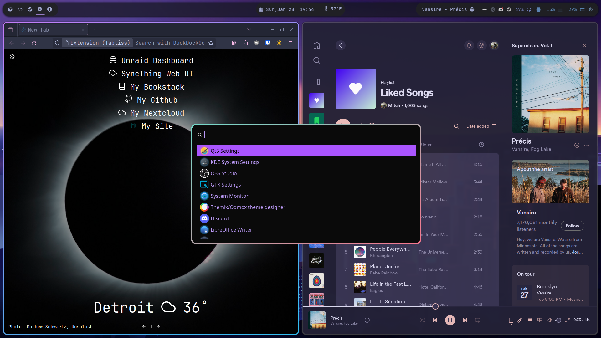

## My Dotfiles

### Themes

Font Face: Jetbrains Mono

GTK:

 - gtk-icon-theme-name = Vivid-Glassy-Dark-Icons
 - gtk-theme-name = Vivid-Dark-GTK
 - gtk-cursor-theme-name = Twilight-cursors

QT5:
 - colorscheme = oomox-arc-dark.conf

Spicetify Theme: Rose Pine

#### Configs
 - mako, swaylock, swayidle, and wofi configs
 - ideavmrc for Jetbrains IDE vim configurations
 - kitty terminal 
 - Waybar (reqiures waybar_media_display from cargo)
 - R settings - Rprofile and Renviron
 - zshrc

#### Scripts
 - clean_dos_formatting.sh - Remove special characters added by Windows
 - java_cert_renewal.sh - Automatically pull SSL certificates into Java keystore
 - sort_directory.sh - Move files from Download folder to a location based on filetype
 - toggle_compositor.sh - Turn compositor on/off for gaming
 - mediaplayer.py - Detects currently playing media
 - switch-windows.py - Window switcher for wofi
 - weather.sh - Get the weather from a location
